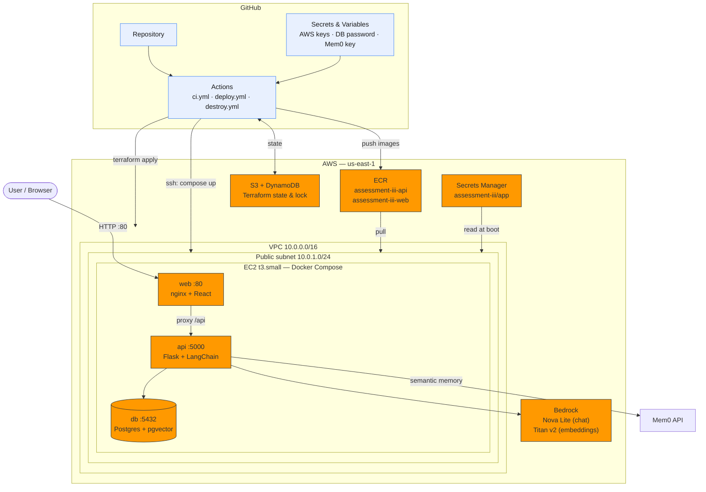
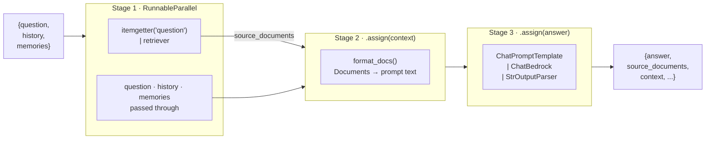
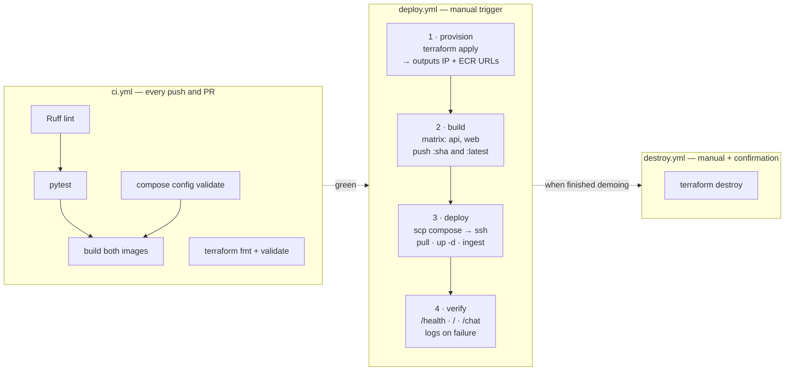
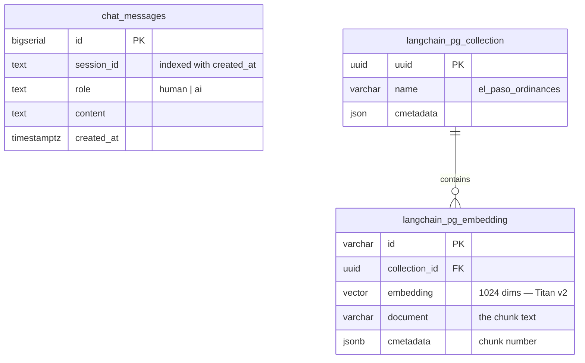

# Architecture

A three-tier RAG application delivered by a GitHub Actions pipeline. The app answers
questions about the El Paso municipal code, cites the passages it used, and remembers
the user between sessions.

---

## 1. System architecture



### Request flow

1. The browser loads the React bundle from **nginx**, the only publicly exposed port.
2. Calls to `/api/*` are proxied by nginx to the **Flask** container over the internal
   Docker network. The API and the database are never reachable from the internet.
3. Flask runs one RAG turn:
   - reads **session memory** (this conversation) from Postgres,
   - reads **semantic memory** (durable facts about the user) from Mem0,
   - invokes the LCEL chain, which retrieves from **pgvector**, formats the
     context, fills the prompt template and calls **Bedrock**,
   - writes the turn back to both memory layers.
4. The answer returns with the source chunks that produced it.

### The chain



Stage 1 keeps the raw `Document` objects alongside the generated answer, which is
why the API can cite the exact chunks behind every response. Retrieval mode is
configurable (`RETRIEVER_SEARCH_TYPE=similarity|mmr`) — MMR diversifies the
retrieved context so near-duplicate ordinance passages don't fill the prompt.

### Why each tier is where it is

| Decision | Reason |
|---|---|
| pgvector instead of a separate vector DB | The database tier and the vector store are the same service — one container, one backup, one thing to explain. |
| nginx in front of React | Satisfies the "frontend + web server" tier and removes CORS entirely: the browser only ever talks to one origin. |
| No API URL in the frontend bundle | The frontend calls the relative path `/api`. The same image runs locally and on EC2 with no rebuild. |
| Images built in CI, not on the server | The EC2 instance needs only Docker. No Node, no Python toolchain, no source code on the box. |
| Secrets in Secrets Manager, read at boot | The instance's IAM role fetches them. Nothing sensitive passes through Terraform state or the compose file. |

---

## 2. CI/CD pipeline



### What each job proves

| Job | Gate |
|---|---|
| `backend` | Code is lint-clean and four unit tests pass with no AWS access. |
| `compose` | Both compose files parse and interpolate — YAML mistakes never reach the server. |
| `images` | Both Dockerfiles build. Runs only after the tests are green. |
| `terraform` | Configuration is formatted and valid, checked without credentials. |
| `provision` | Infrastructure matches the code; the run summary prints the live URL. |
| `build` | Images are tagged with the commit SHA, so any deploy traces to exact source. |
| `deploy` | Waits for SSH, ships compose, pulls, starts, and loads the knowledge base. |
| smoke test | Health returns `ok`, the frontend serves, and a real question round-trips through the RAG chain. Failure dumps container logs. |

---

## 3. Database schema

Two things live in Postgres: the conversation history the app writes, and the
LangChain-managed pgvector tables that hold the embedded corpus.



`chat_messages` is created by `db/init.sql`. The two `langchain_pg_*` tables are
created automatically by the `PGVector` store the first time `ingest.py` runs.

**Dimension warning:** the embedding column is fixed at the width of the model that
wrote it. Changing `EMBEDDING_MODEL_ID` after ingesting means re-ingesting with
`FORCE_INGEST=1` — retrieval silently degrades otherwise.

---

## 4. Secrets and configuration

Nothing sensitive is committed. Values reach the running container by three paths:

```
Developer laptop     .env  (gitignored, from .env.example)
                       │
                       ▼
GitHub               Secrets: AWS_ACCESS_KEY_ID, AWS_SECRET_ACCESS_KEY,
                              POSTGRES_PASSWORD, MEM0_API_KEY, EC2_SSH_KEY
                     Variables: EC2_KEY_NAME
                       │  set in one command by scripts/set-secrets.sh
                       ▼
Terraform            TF_VAR_* environment variables  →  Secrets Manager
                       │
                       ▼
EC2 boot             IAM role reads the secret  →  writes /home/ubuntu/app/.env (chmod 600)
                       │
                       ▼
Containers           compose reads .env  →  environment variables
```

The application code reads only environment variables — `rag.py` and `memory.py`
contain no literal credentials, endpoints, or model IDs that cannot be overridden.

### IAM — least privilege

The instance role allows exactly three things:

| Permission | Scope | Why |
|---|---|---|
| `bedrock:InvokeModel*` | `*` | Bedrock model ARNs vary by region and inference profile. |
| `ecr:Get*`, `ecr:Batch*` | `*` | Pull the two images. Read-only; the instance cannot push. |
| `secretsmanager:GetSecretValue` | this secret's ARN | Scoped to one secret, not all of them. |

The instance holds no AWS access keys.

---

## 5. Repository layout

```
aico-assessment-iii/
├── docker-compose.yml          # local: builds from source
├── docker-compose.deploy.yml   # EC2: pulls from ECR
├── .env.example
├── backend/
│   ├── app.py                  # Flask: /health /chat /memories
│   ├── rag.py                  # LangChain chain + pgvector retriever
│   ├── memory.py               # session memory (Postgres) + semantic memory (Mem0)
│   ├── ingest.py               # load → split → embed → store
│   ├── test_app.py             # unit tests, no external services
│   ├── corpus/                 # the El Paso ordinance text
│   └── Dockerfile
├── frontend/
│   ├── src/App.jsx             # chat UI, sources, memory panel
│   ├── nginx.conf              # web server + /api proxy
│   └── Dockerfile              # multi-stage: node build → nginx
├── db/init.sql                 # pgvector extension + chat_messages
├── terraform/                  # VPC, SG, IAM, ECR, Secrets Manager, EC2
├── .github/workflows/          # ci.yml, deploy.yml, destroy.yml
├── scripts/                    # bootstrap-state.sh, set-secrets.sh, local-up.sh
└── docs/architecture.md        # this file
```
